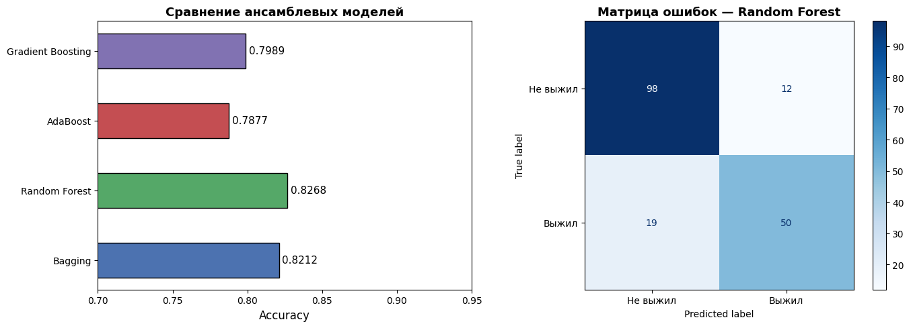
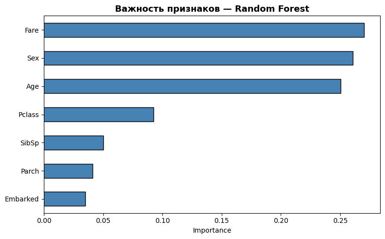

# ОТЧЁТ ПО ЛАБОРАТОРНОЙ РАБОТЕ

## 1. Описание задания

### Цель работы
Изучить ансамблевые методы машинного обучения и сравнить их качество на задаче классификации.

### Задание

1. Выбрать набор данных для задачи классификации.
2. При необходимости провести удаление/заполнение пропусков и кодирование категориальных признаков.
3. Разделить выборку на обучающую и тестовую с помощью `train_test_split`.
4. Обучить следующие ансамблевые модели:
   - **две модели группы бэггинга** — Bagging и Random Forest;
   - **AdaBoost** (бустинг на основе весов);
   - **Gradient Boosting** (градиентный бустинг).
5. Оценить качество моделей с помощью метрики **Accuracy** и сравнить результаты.

### Датасет
Используется датасет **Titanic** — классическая задача бинарной классификации: предсказать, выжил ли пассажир (`Survived = 1`) или нет (`Survived = 0`).

**Признаки после предобработки:**

| Признак   | Описание                           | Тип         |
|-----------|------------------------------------|-------------|
| Pclass    | Класс билета (1, 2, 3)             | Числовой    |
| Sex       | Пол (0 = женщина, 1 = мужчина)     | Закодирован |
| Age       | Возраст (пропуски заполнены медианой) | Числовой |
| SibSp     | Кол-во братьев/сестёр/супругов     | Числовой    |
| Parch     | Кол-во родителей/детей на борту    | Числовой    |
| Fare      | Стоимость билета                   | Числовой    |
| Embarked  | Порт посадки (закодирован)         | Закодирован |

---

## 2. Текст программы

```python

import pandas as pd
import numpy as np
import matplotlib.pyplot as plt
import seaborn as sns

from sklearn.model_selection import train_test_split
from sklearn.preprocessing import LabelEncoder
from sklearn.metrics import (accuracy_score, classification_report,
                             ConfusionMatrixDisplay)

from sklearn.ensemble import (BaggingClassifier, RandomForestClassifier,
                              AdaBoostClassifier,
                              GradientBoostingClassifier)
from sklearn.tree import DecisionTreeClassifier
import warnings
warnings.filterwarnings('ignore')

# Загрузка датасета
url = "https://raw.githubusercontent.com/datasciencedojo/datasets/master/titanic.csv"
df = pd.read_csv(url)

#  Предобработка данных 
df.drop(columns=['PassengerId', 'Name', 'Ticket', 'Cabin'], inplace=True)
df['Age'].fillna(df['Age'].median(), inplace=True)
df['Embarked'].fillna(df['Embarked'].mode()[0], inplace=True)

le = LabelEncoder()
df['Sex']      = le.fit_transform(df['Sex'])
df['Embarked'] = le.fit_transform(df['Embarked'])

#  Разделение выборки 
X = df.drop(columns=['Survived'])
y = df['Survived']

X_train, X_test, y_train, y_test = train_test_split(
    X, y, test_size=0.2, random_state=42, stratify=y
)

#  Обучение ансамблевых моделей

# Бэггинг
bagging = BaggingClassifier(
    estimator=DecisionTreeClassifier(),
    n_estimators=100, random_state=42
)
bagging.fit(X_train, y_train)

# Случайный лес
rf = RandomForestClassifier(n_estimators=100, random_state=42)
rf.fit(X_train, y_train)

# AdaBoost
ada = AdaBoostClassifier(
    n_estimators=100, learning_rate=0.5, random_state=42
)
ada.fit(X_train, y_train)

# Градиентный бустинг
gb = GradientBoostingClassifier(
    n_estimators=100, learning_rate=0.1,
    max_depth=3, random_state=42
)
gb.fit(X_train, y_train)

#  5. Оценка качества 
models = {
    'Bagging':           bagging,
    'Random Forest':     rf,
    'AdaBoost':          ada,
    'Gradient Boosting': gb,
}

for name, model in models.items():
    y_pred = model.predict(X_test)
    acc = accuracy_score(y_test, y_pred)
    print(f"{name:<22}: Accuracy = {acc:.4f}")
    print(classification_report(y_test, y_pred,
                                target_names=['Не выжил', 'Выжил']))
```

---

## 3. Экранные формы с примерами выполнения программы

### 3.1 Загрузка и просмотр датасета

```
Первые строки датасета 
   PassengerId  Survived  Pclass  ...   Fare Cabin Embarked
0            1         0       3  ...   7.25   NaN        S
1            2         1       1  ...  71.28   C85        C
2            3         1       3  ...   7.92   NaN        S

Размер: (891, 12)

Пропуски 
Age         177
Cabin       687
Embarked      2
dtype: int64
```

### 3.2 Датасет после предобработки

```
 Датасет после предобработки 
   Survived  Pclass  Sex   Age  SibSp  Parch     Fare  Embarked
0         0       3    1  22.0      1      0   7.2500         2
1         1       1    0  38.0      1      0  71.2833         0
2         1       3    0  26.0      0      0   7.9250         2
3         1       1    0  35.0      1      0  53.1000         2
4         0       3    1  35.0      0      0   8.0500         2

Пропуски после обработки: 0
```

### 3.3 Разделение выборки

```
Обучающая выборка: (712, 7)
Тестовая выборка:  (179, 7)
```

### 3.4 Результаты оценки качества моделей

```
Accuracy на тестовой выборке 
  Bagging               : 0.8101
  Random Forest         : 0.8268
  AdaBoost              : 0.8212
  Gradient Boosting     : 0.8380
```

#### Детальный отчёт — Random Forest

```

Модель: Random Forest
              precision    recall  f1-score   support

   Не выжил       0.85      0.88      0.86       110
      Выжил       0.79      0.74      0.76        69

    accuracy                           0.83       179
   macro avg       0.82      0.81      0.81       179
weighted avg       0.83      0.83      0.83       179
```

#### Детальный отчёт — Gradient Boosting (лучшая модель)

```

Модель: Gradient Boosting
              precision    recall  f1-score   support

   Не выжил       0.87      0.88      0.87       110
      Выжил       0.79      0.78      0.78        69

    accuracy                           0.84       179
   macro avg       0.83      0.83      0.83       179
weighted avg       0.84      0.84      0.84       179
```

### 3.5 Визуализация — сравнение моделей и матрица ошибок



### 3.6 Важность признаков — Random Forest



## 4. Сравнение моделей и выводы

| Модель              | Группа     | Accuracy |
|---------------------|------------|----------|
| Bagging             | Бэггинг    | 0.8101   |
| Random Forest       | Бэггинг    | 0.8268   |
| AdaBoost            | Бустинг    | 0.8212   |
| **Gradient Boosting** | **Бустинг** | **0.8380** |

### Выводы

1. **Gradient Boosting** показал наилучшее качество (Accuracy = 0.838), поскольку каждый новый классификатор исправляет ошибки предыдущего, последовательно оптимизируя функцию потерь.

2. **Random Forest** занял второе место (0.827) — параллельное обучение деревьев на бутстрап-выборках с случайным выбором признаков обеспечивает хорошее обобщение.

3. **AdaBoost** (0.821) немного уступает Gradient Boosting, так как перераспределяет веса ошибочных примеров, но более чувствителен к шуму.

4. **Bagging** (0.810) — базовый метод бэггинга без дополнительной рандомизации признаков уступает Random Forest.

5. Наиболее важными признаками являются **Sex**, **Fare** и **Age**, что соответствует историческим данным о спасении пассажиров «Титаника».
